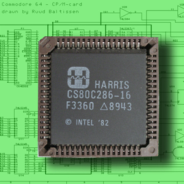

# Chips and circuits
> This is chips and circuits assignment for the course programming theory, as a part of minor programming from the University Van Amsterdam.

Integrated circuits are widely used. They are usually designed logically and subsequentially transformed into a list of connectable gates. This list, commonly known as a netlist is finally transformed into a 2-dimensional design on a silicon base.
